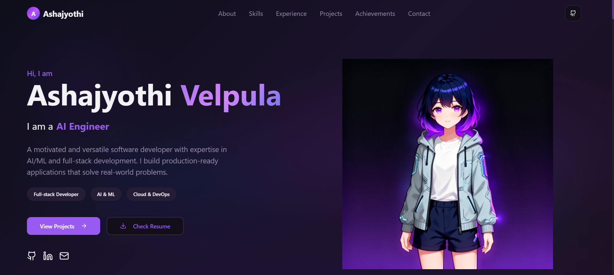
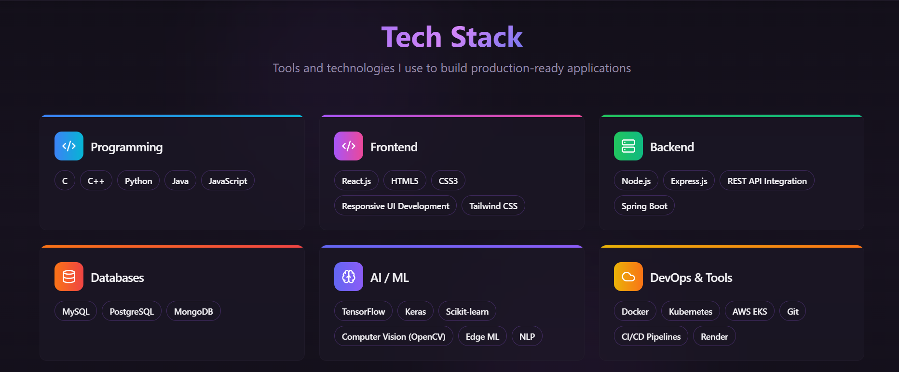
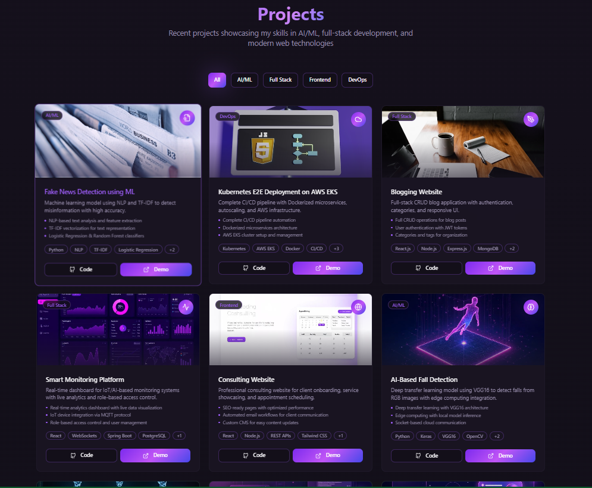
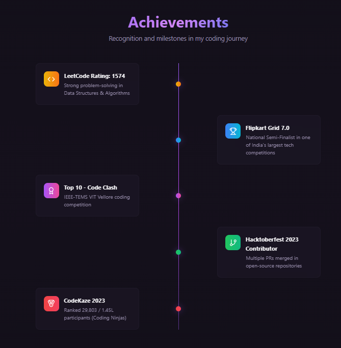
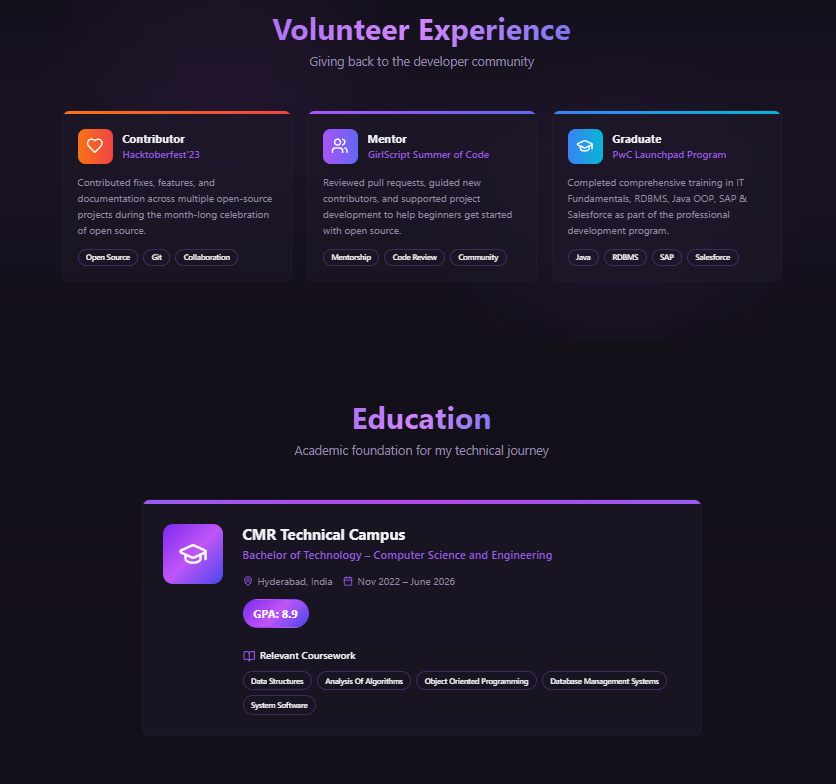
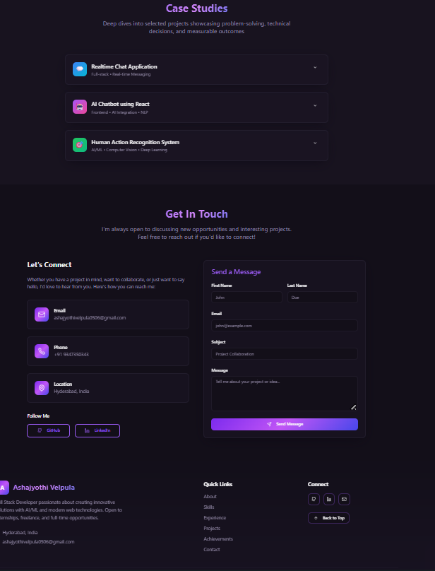

# 🌐 Personal Portfolio Website

This is my personal portfolio website, designed and developed to showcase my skills, projects, experience, and journey as a Computer Science engineer and frontend developer. The website reflects my passion for clean UI, modern web technologies, and problem-solving.

## 🚀 About the Project

My portfolio serves as a centralized platform where I present:

Who I am and what I do

My technical skills and interests

Projects I’ve built and worked on

Achievements and milestones

Professional experience and internships

Case studies highlighting real-world problem solving

Ways to get in touch with me

### The goal of this project is to create a simple, elegant, and responsive digital identity that represents my work and growth in technology.

## 🧩 Sections Included

Home – A quick introduction and overview

About – My background, skills, and interests

Projects – A collection of projects with descriptions and tech stacks

Case Studies – In-depth breakdowns of selected projects and solutions

Experience – Internships, roles, and hands-on experience

Achievements – Certifications, recognitions, and milestones

Contact – Ways to connect with me

## 🛠️ Tech Stack

Frontend: React, TypeScript, HTML, CSS

Styling: Tailwind CSS / Custom CSS

Build Tool: Vite

UI Components: Modern reusable components

Version Control: Git & GitHub

## ✨ Features

Fully responsive design (desktop, tablet, mobile)

Clean and modern UI

Easy navigation across sections

Scalable component-based architecture

Optimized performance and fast loading

SEO-friendly structure

## 📸 Screenshots

## ⚙️ How to Run Locally
### Clone the repository
git clone <your-repo-url>

### Navigate to the project folder
cd <project-folder-name>

### Install dependencies
npm install

### Start the development server
npm run dev

The application will be available at:

http://localhost:5173

## 🎯 Purpose & Learning Outcomes

Through this project, I:

Improved my frontend development skills

Gained experience in building scalable React applications

Practiced UI/UX design principles

Learned to structure and present projects professionally

Built a strong personal brand and online presence

## 📬 Contact

If you’d like to collaborate, provide feedback, or just connect, feel free to reach out through the Contact section on my portfolio.